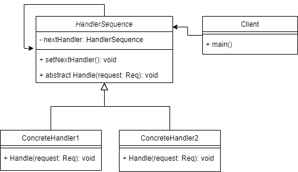

# Chain of responsibilities Pattern 
Chain of responsibilities Pattern aims to decouple the sender of the request 
to its receiver by giving more than one object a chance to handle it or 
pass it to the next handler, 
or from another point of view it's like a pipeline each stage has its own 
process to the product.

## when to use ?
- When you want to decouple the sender from the receiver
- When multiple objects which handles the request specified at runtime
- When you want to layer the system

## Advantages 
- Hide the information about which object handles the request
- Gives you a flexibility in distributing the kinds of handlers

## Diagram

