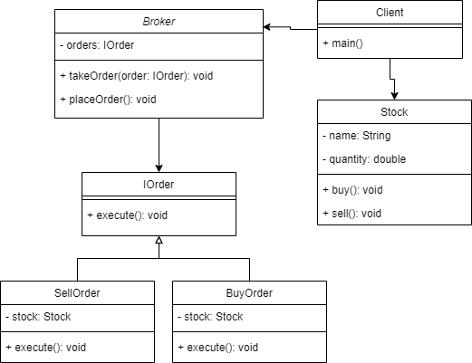

# Command Pattern 
Command pattern is used to encapsulate the request object/**Command** with its 
implementation to decouple the request from the sender and the receiver,
and you can queue and log those command, besides undoing them

## when to use ?
- When you want to queue the request to be executed in a different time
  - the request may have a lifetime independent of the original request
- When you want to support undo
  - the command's execute method can save the state for reversing its
  effects in the command itself
- When you want to support logging changes, so they can be reapplied in case
of system crash
  - you can support load and save interface for the command
- When you want to implement a callback method

## Diagram

