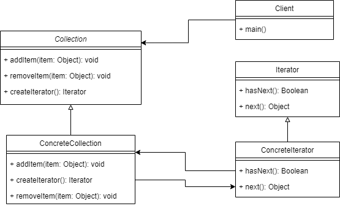

# Iterator Pattern 
Iterator Pattern provides a way to access the elements of an aggregate object 
sequentially without exposing its underlying representation
> iterator used to traverse a container to access its elements
> like linked list, array list, list, hash table, etc.

## when to use ?
- When you want to provide a standard way to iterate over a collection and 
  hide the implementation logic from client program
  - logic for iteration is embedded in the collection itself,and it helps client
  program to iterate over them easily
- When you have multiple data containers change dynamically at run time, 
  and you need to iterate over them using the same function
  - decouple the way of iterating the data from the object used them

## Diagram

