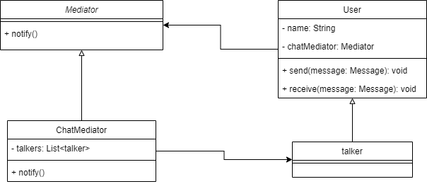

# Mediator Pattern 
Mediator Pattern defines an object that encapsulates how a set of objects
interact, promotes loose coupling by keeping objects from referring to each other
explicitly.

The Mediator is the one who takes the responsibility of communication among a
group of objects.
- acts as an intermediary who can track the communication between two objects
- the other objects in the system also aware of the mediator 
  - they know that if they want to communicate they have to go through the 
  mediator

## when to use ?
- When you want to centralize complex communications and control between related 
objects
- When a set of objects communicate in well-defined but complex manner
  - The resulting interdependencies are unstructured and difficult to understand

## Advantages
- increases the reusability of the objects supported by the mediator by 
decoupling them from the system
- simplifies maintenance of the system by centralizing control logic
- 
## Diagram

