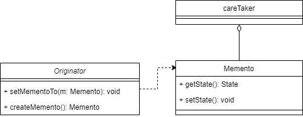

# Memento Pattern 
Memento Pattern will capture and externalize an object's internal state so that
the object can be restored to this state later, without violating encapsulation

# Real life examples
- in notepad, we use undo frequently by pressing **ctrl + z**
- database can use it to roll back a transaction operation
- in video games:
  - players can store their progress in order to restore them when the character
  died
  - **Save progress** would return the player to the last state
- 

## when to use ?
- If you want to apply the undo command to your object to restore its previous 
state, or you want ot save it anyway

## Advantages
- provides easy to implement the recovery capability
## Diagram

