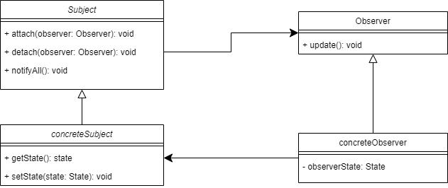

# Observer Pattern 
Observer Pattern defines a one-to-many dependency between objects so that when 
one object changes state, all of its dependencies are notified and updated 
automatically

# Real life examples
- heavily used in the gui system like:
  - buttons and eventListeners, when the event occurs all event listeners are
  notified to execute them self

## when to use ?
- When a change to one object requires changing others, and you don't know 
how many objects need to be changed
- When multiple objects are dependent on the state of another

## Diagram

