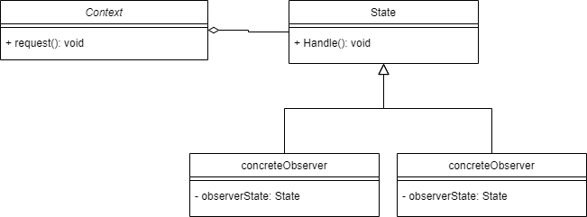

# State Pattern 
State Pattern allows the object to alter its behavior when its internal 
state changes
- Behavior changes at the run time depending on the state
- it's like a finite state machine [link](https://en.wikipedia.org/wiki/Finite-state_machine) 

# Real life examples
- traffic states
  - red, green, yellow each state has a different behavior
- TCP connection has different states
  - established, listening and closed

## when to use ?
- When a change the state of an object requires changing its behavior at run time

## Advantages
- put all behaviors associated with a state into one object
- if there is any transitions, they could be placed withing the state itself
rather than monolithic complex conditions

## Diagram

