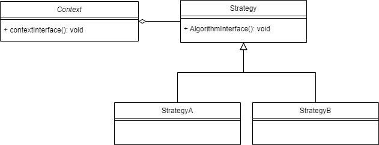

# Strategy Pattern 
Strategy Pattern defines a family of algorithms, encapsulates each one, and 
make them interchangeable
> we can select the behavior of an algorithm at run time

## Real life examples
it's like a search algorithm the intention is the search, but it can vary 
in the implementation algorithm as we can use:
- BFS
- DFS
- anything else

## Advantages
- it's easy to introduce new algorithms, them easy to use them
- application can change them at run-time thanks to polymorphism
- simplifies unit-testing as each algorithm in its own class

## Diagram

