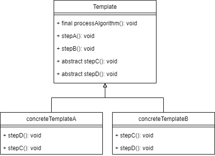

# Template Pattern 
Template Pattern defines a skeleton for an algorithm in an operation as steps/hooks,
deferring some steps to subclasses to implement

## When to use?
- When you need to support an algorithm with steps but some of them may have
different implementation
- When you want to avoid code duplication in an algorithm
- When you want to control at what points sub classing is allowed

## Diagram

