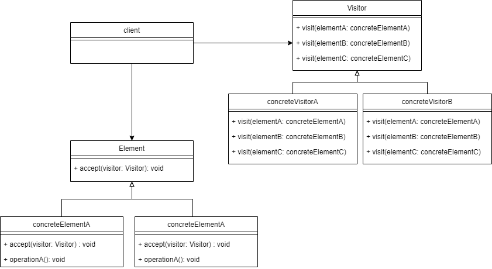

# visitor Pattern 
Visitor Pattern lets you define a new functionalities to a class without 
effecting the class itself

## Examples
- consider a taxi booking scenario
  - a taxi arrives at the defined location for the pickup
  - once we enter into it, the visitor taxi takes the control of the transportation
  - it can choose a different way towards our destination and we may or may not 
  know any prior knowledge about that

## When to use?
- When an object structure (collection or list) contains many objects with 
different interfaces, and you want to perform operations on these objects that depend
on their concrete classes
  - visitor lets you keep related operations together by defining them in one class
  

## Advantages
- it allows for one or more operations to be applied to a set of objects at 
runtime, decoupling the operations from the object structure
- it can move the logic operations into another class

## Diagram

