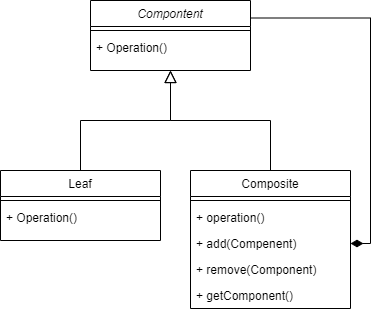

# Composite Pattern
Composite Pattern is about one class composites from many others classes have the 
same functionality

## when to use ?
- When you need to deal with the composite object the same as individual
    - less complex in this situation to treat the primitives like the composites
- When you worried about the memory usage
- When you take care of the order of the children ordering

## Advantages 
- make it easy to add new component
  - you only have to implement the interface function
- clients don't even know they're dealing with individual or composite
- 
## Diagram

