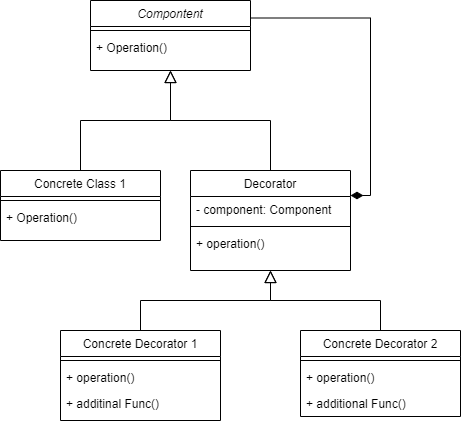

# Decorator Pattern
Decorator Pattern is used to add new responsibility/functionality to the class object
at runtime

## when to use ?
- When you need to add new responsibilities dynamically
- When the process of subclassing will lead to massive classes
- When the interface is hidden or can't be derived

## Advantages 
- you can add new functionality to the object without disturbing the existing code
- more flexibility than static inheritance
  - responsibilities can be added or removed at run time simply by attaching or detaching
  them
- you can add the functionality twice by attaching it two times
  - > like you can add border twice to the widget

## Diagram

