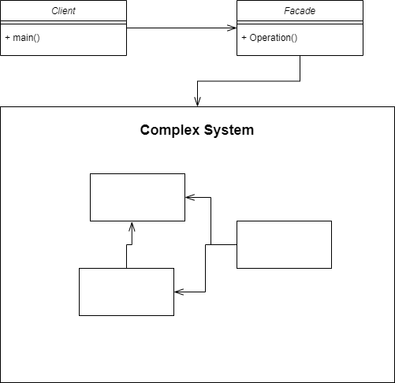

# Facade Pattern
Facade Pattern is used to hide the complexity of an operation from the user to
make it easier for him

## when to use ?
- When you want to provide interfaces to a complex subsystem
- Promotes subsystem independence and portability
- When you want to layer the system

## Advantages 
- shield the client from the subsystem components
  - reduces the number of components the client deal with
  - makes the subsystem easier to use

- helps to layer the system

## Diagram

